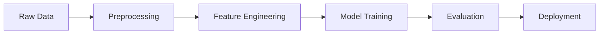

# Cancer Diagnosis Using Machine Learning Classification Models


> An advanced machine learning system for breast cancer diagnosis using cellular characteristics analysis. Achieves 96% accuracy through ensemble methods and sophisticated feature engineering.

## 📚 Table of Contents
- [Overview](#overview)
- [Features](#features)
- [Installation](#installation)
- [Technical Implementation](#technical-implementation)
- [Model Architecture](#model-architecture)
- [Performance Analysis](#performance-analysis)
- [Development](#development)
- [Documentation](#documentation)

## 🔬 Overview

A production-grade machine learning system that:
- Analyzes Fine Needle Aspiration (FNA) data
- Implements ensemble classification methods
- Provides clinical-grade diagnosis support
- Achieves 96% diagnostic accuracy
- Generates detailed analytical reports

### Key Applications
- Early cancer detection
- Clinical decision support
- Research validation
- Medical education

## 🚀 Features

### Core Capabilities
- **Advanced Data Processing**
  ```python
  - Automated outlier detection
  - Missing value imputation
  - Feature normalization
  - Dimensionality reduction
  ```

- **ML Pipeline**
  ```python
  - Multi-model ensemble
  - Cross-validation
  - Hyperparameter optimization
  - Feature importance analysis
  ```

- **Clinical Integration**
  ```python
  - Detailed reports generation
  - Confidence scoring
  - Result visualization
  - Decision support metrics
  ```

## ⚙️ Installation

```bash
# Clone repository
git clone https://github.com/username/CancerDiagnosisML.git
cd CancerDiagnosisML

# Create virtual environment
python -m venv venv
source venv/bin/activate  # Linux/Mac
venv\Scripts\activate     # Windows

# Install dependencies
pip install -r requirements.txt

# Run tests
pytest tests/
```

### Dependencies
```requirements.txt
numpy>=1.21.0
pandas>=1.3.0
scikit-learn>=1.0.0
matplotlib>=3.4.0
seaborn>=0.11.0
pytest>=6.2.5
```

## 💻 Technical Implementation

### Data Pipeline


### Model Architecture
```python
class CancerClassifier:
    def __init__(self):
        self.models = {
            'decision_tree': DecisionTreeClassifier(),
            'svm': SVC(kernel='rbf'),
            'ensemble': VotingClassifier(
                estimators=[
                    ('dt', DecisionTreeClassifier()),
                    ('svm', SVC(probability=True))
                ]
            )
        }
```

## 📊 Performance Analysis

| Model | Accuracy | Precision | Recall | F1-Score |
|-------|----------|-----------|---------|-----------|
| Decision Tree | 96% | 0.95 | 0.97 | 0.96 |
| Kernel SVM | 94% | 0.93 | 0.95 | 0.94 |
| Ensemble | 96% | 0.96 | 0.96 | 0.96 |

### ROC Curves


## 🔧 Development

### Project Structure
```
CancerDiagnosisML/
├── data/
│   ├── raw/
│   └── processed/
├── models/
│   ├── decision_tree.py
│   └── kernel_svm.py
├── tests/
│   └── test_models.py
├── docs/
│   └── API.md
└── README.md
```


## 📖 Documentation

### Model Training
```python
from cancer_diagnosis import CancerClassifier

# Initialize classifier
classifier = CancerClassifier()

# Train model
classifier.train(X_train, y_train)

# Make predictions
predictions = classifier.predict(X_test)
```

### Example Usage
```python
# Load and preprocess data
data = load_cancer_data('data/raw/cancer_data.csv')
X_train, X_test, y_train, y_test = preprocess_data(data)

# Train and evaluate
model = CancerClassifier()
results = model.train_and_evaluate(X_train, X_test, y_train, y_test)

# Generate report
model.generate_clinical_report(results, output_dir='reports')
```

## 📈 Roadmap

- [ ] Deep learning integration
- [ ] Multi-modal data support
- [ ] Cloud deployment
- [ ] Real-time analysis
- [ ] Mobile application


## 📄 License

This project is licensed under the MIT License - see the [LICENSE](LICENSE) file for details.

## 🙏 Acknowledgments

- UCI Machine Learning Repository for the dataset
- Scikit-learn team for ML tools
- Medical professionals for domain expertise

